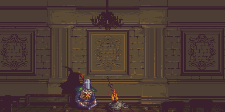

# Starter Clone Jutsu - BELIEVE IT

## Prisma

Any starter development changes and first refactor when using starter

-   `npx prisma db push`

After changes have been made, update local client to use prisma autocomplete

-   `npx prisma generate` or just run `npm install`

Any app development changes after initializing starter

-   `npx prisma migrate dev --name name_of_changes`

View current database and manually update data

-   `npx prisma studio`

---

## Github Branching

### **_`main`_**

-   ### **_`staging`_**

-   ### **_dev_**

    -   ### feature/name_of_feature
    -   ### debug/name_of_error
